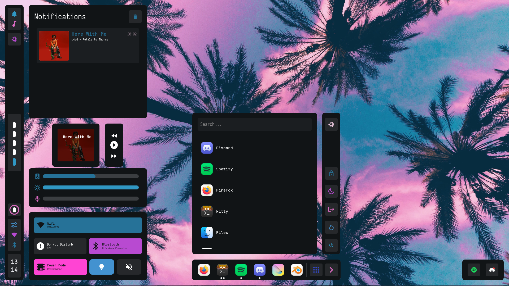
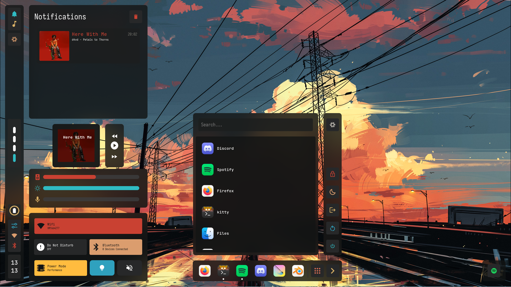
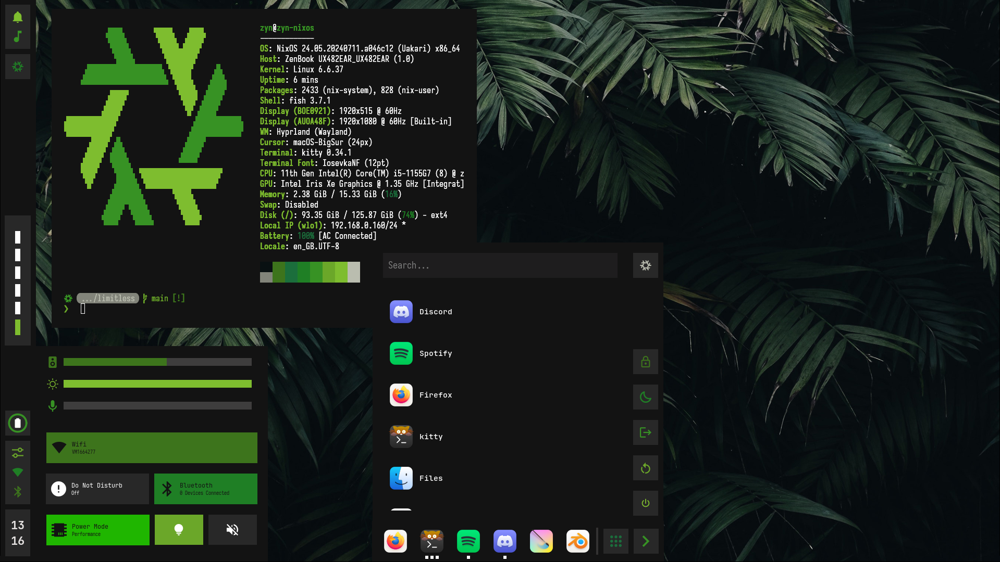

# NixOS Flake
> [!Caution]
> under construction; 
> [old dotfiles](https://github.com/cmrcrabs/dotfiles)

## Temporary Preview
(very unfinished, esp media widget)

## TODO

- [ ] AGS
    - [X] rewrite to use header font & body font
    - [X] kitty font declarative
    - [X] Horizontal Bar Initial
    - [X] Data Structure for config
    - [ ] Rework widgets to work with horizontal bar 
    - [ ] Theming Bars
    - [ ] Theming Switches
    - [ ] Font Menu
    - [ ] Wallpaper Selector
    - [ ] Update Control center margin
    - [ ] rounded corners
    - [ ] stack for label with date & time
    - [ ] Hyprspace Integration
    - [ ] update css to work with light mode
    - [ ] track with home manager

- [ ] Hyprland
    - [ ] Window Shadows
    - [ ] AGS Widget Shadows
    - [ ] Redesign Hyprlock
    - [ ] Floating Kitty Window Rule
    - [ ] fix alt-k
    - [ ] add keybind to setup floating terminals for dev env

- [ ] Hyprland Plugins
    - [ ] Setup Hyprspace
    - [ ] Setup Hyprbars

- [ ] Neovim
    - [ ] migrate mason to nix / both 
    - [ ] Prism / Custom Theme
    - [ ] Custom Bufferline
    - [ ] Custom Statusline
    - [ ] Incl. Startup time on dash
    - [ ] optimise startup time
    - [ ] adjusting border shape to config
    - [ ] readme for nvim config + previews (with colors)
    - [ ] fix priority for cmp

- [ ] TMUX

- [ ] zsh
    - [ ] migrate aliases + starship
    - [ ] zsh colorscheme
    - [ ] zsh light / dark mode
    - [ ] setup up to fish level
    - [ ] zoxide
    - [ ] update starship prompt
    - [ ] potentially switch to jetpack

- [ ] GTK
    - [ ] Gradience CLI Setup

- [ ] Firefox
    - [ ] setup current to be fully declarative
        - [ ] extensions
        - [ ] extension configuration
        - [ ] exceptions
        - [ ] bookmarks?
    - [ ] Vertical Tabs
    - [ ] modify userChrome to follow colors
    - [ ] setup font using ags

- [ ] Thunderbird
    - [ ] lightning for google calendar integration

- [ ] Nix
    - [ ] move packages to home.packages
    - [ ] package debloating
    - [ ] cleanup unused files
    - [ ] make hostname a variable
    - [ ] make monitor names a variable

- [ ] Misc
    - [ ] Headphone Jack
    - [ ] Working Bluetooth (?)
    - [ ] setup kernel module(s) declaratively (lower screen brightness)
    - [ ] setup refind
    - [ ] refind-minimal
    - [ ] mesa version mismatch
    - [ ] Stylus Setup (Pressure, Tilt, Calibration)
    - [ ] run asus dial control panel (through bottles?)
    - [ ] define xdg-user-dirs

- [ ] Repo
    - [ ] Clean Up wallpaper Repo
    - [ ] upper/lower wallpapers (incl. in ags?)
    - [ ] Write Up README.md (use kaku as ref)
    - [ ] Create limitless svg
        - [ ] use to create neofetch image
        - [ ] add to ags where specified
    - [ ] Preview Images
    - [ ] write script to install cli environmnent specifically
    - [ ] readme for wallpaper repo
    - [ ] editing of github settings for repo

- [ ] rewrite everything from scratch eventually

## Credits:
for their great configs / learning resources / software

- LibrePhoenix
- Misterio77
- InioX
- datsfilipe
- Aylur
- HyprNova
- ChadCat7
- linuxmobile
- kotontrion (ags help)
- end4 
