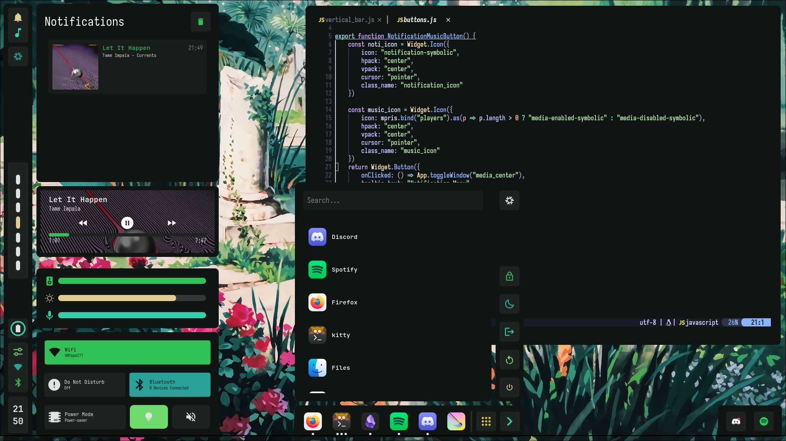
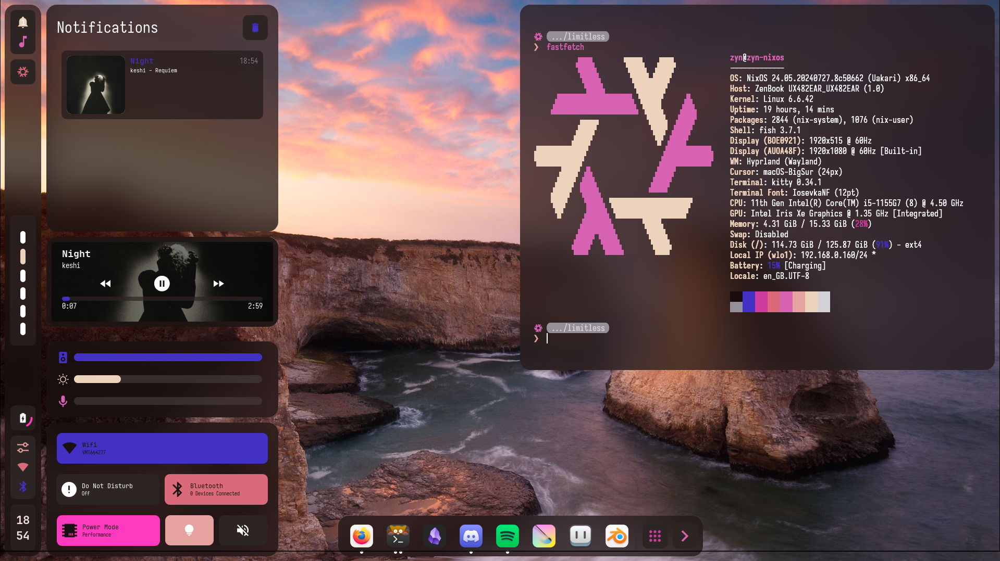
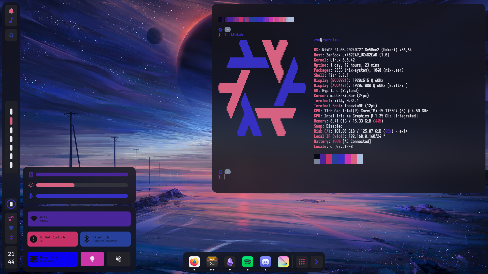
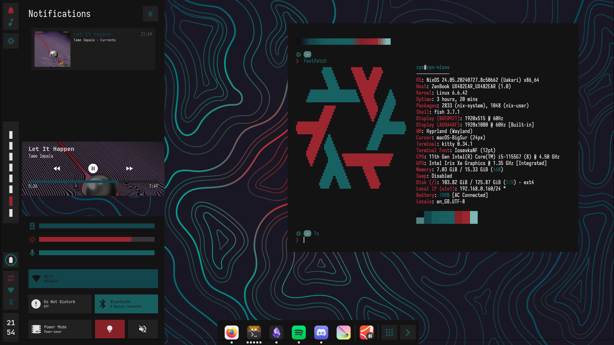

# NixOS Flake
> [!Caution]
> under construction; 
> [old dotfiles](https://github.com/cmrcrabs/dotfiles)

## Temporary Preview
(forever unfinished)

## TODO

- [ ] AGS
    - [X] rewrite to use header font & body font
    - [X] kitty font declarative
    - [ ] matugen scheme dropdown
    - [ ] redesign in pseudo spec with material you (icons, scaling)
    - [ ] redesign dock
    - [ ] volume / brightness notifications
    - [ ] Data Structure for config
    - [ ] toggleable screen rounded corners
    - [ ] volume mixer
    - [ ] redesign in spec with material design (?)
    - [ ] add button for hypridle toggle
    - [ ] change noti icon to update if no notifications
    - [ ] make sure light mode looks good
    - [ ] Theming Bars
    - [ ] Theming Switches
    - [ ] Font Menu
    - [ ] Wallpaper Selector
    - [ ] Update Control center margin
    - [ ] Rework widgets to work with horizontal bar 
    - [ ] rounded corners
    - [ ] stack for label with date & time
    - [ ] update css to work with light mode
    - [ ] rewrite horizontal bar
    - [ ] integrate dock into bar?
    - [ ] create float -> hex fn and use for border transparency
    - [ ] Hyprspace Integration
    - [ ] track with home manager
    - [ ] horizontal bar rewrite
    - [ ] shift other widgets for horizontal bar

- [ ] Hyprland
    - [ ] Window Shadows
    - [ ] AGS Widget Shadows
    - [ ] Redesign Hyprlock
    - [ ] Floating Kitty Window Rule
    - [ ] fix alt-k
    - [ ] add keybind to setup floating terminals for dev env
    - [ ] color picker
    - [ ] clipboard manager
    - [ ] redo keybinds?
    - [ ] screensharing

- [ ] Hyprland Plugins
    - [ ] Setup Hyprspace
    - [ ] Setup Hyprbars
    - [ ] setup hyprgrass
    - [ ] Setup Hyprshade (wlsunset)
    - [ ] hyprchroma

- [ ] Neovim
    - [ ] migrate mason to nix / both 
    - [ ] Prism / Custom Theme
    - [ ] Custom Bufferline
    - [ ] Custom Statusline
    - [ ] Incl. Startup time on dash
    - [ ] optimise startup time
    - [ ] adjusting border shape to config
    - [ ] readme for nvim config + previews (with colors)
    - [ ] fix priority for cmp

- [ ] TMUX
    - [ ] setup
    - [ ] vim integration
    - [ ] keybinds
    - [ ] matugen linking
    - [ ] bar theming
    - [ ] other theming

- [ ] zsh / nushell
    - [ ] migrate aliases + starship
    - [ ] zsh colorscheme
    - [ ] zsh light / dark mode
    - [ ] setup up to fish level
    - [ ] zoxide
    - [ ] update starship prompt
    - [ ] potentially switch to jetpack

- [ ] GTK
    - [ ] Gradience CLI Setup

- [ ] Obsidian
    - [ ] setup as git submodule
    - [ ] track with git
    - [X] setup file structure
    - [X] setup pywal theme
    - [X] setup tagging system
    - [ ] translate notes over
    - [ ] syntax highlighing for code blocks

- [ ] Krita
    - [ ] color theming
    - [ ] ui customizations saved

- [ ] Aseprite
    - [ ] theme the xml file
    - [ ] track with matugen
    - [ ] track with nix

- [ ] Firefox
    - [ ] setup current to be fully declarative
        - [ ] extensions
        - [ ] extension configuration
        - [ ] exceptions
        - [ ] bookmarks?
    - [ ] Vertical Tabs
    - [ ] modify userChrome to follow colors
    - [ ] setup font using matugen

- [ ] Thunderbird
    - [ ] lightning for google calendar integration

- [ ] Nix
    - [ ] move packages to home.packages
    - [ ] package debloating
    - [ ] cleanup unused files
    - [ ] make hostname a variable
    - [ ] make monitor names a variable
    - [ ] screenpad kernel module
    - [ ] modularise config
    - [ ] split into laptop, cli modules

- [ ] Misc
    - [ ] Headphone Jack
    - [ ] Working Bluetooth (?)
    - [ ] setup kernel module(s) declaratively (lower screen brightness)
    - [ ] setup refind
    - [ ] refind-minimal
    - [ ] mesa version mismatch
    - [ ] Stylus Setup (Pressure, Tilt, Calibration)
    - [ ] run asus dial control panel (through bottles?)
    - [ ] define xdg-user-dirs

- [ ] Repo
    - [ ] Clean Up wallpaper Repo
    - [ ] upper/lower wallpapers (incl. in ags?)
    - [ ] Write Up README.md (use kaku as ref)
    - [ ] Create limitless svg
        - [ ] use to create neofetch image
        - [ ] add to ags where specified
    - [ ] Preview Images
    - [ ] write script to install cli environmnent specifically
    - [ ] readme for wallpaper repo
    - [ ] editing of github settings for repo
    - [ ] cleanup wallpapers

## Credits:
for their great configs / learning resources / software / help

- LibrePhoenix
- Misterio77
- InioX
- datsfilipe
- Aylur
- HyprNova
- ChadCat7
- linuxmobile
- kotontrion (ags help)
- end4 
- fufexan
- noamsto
