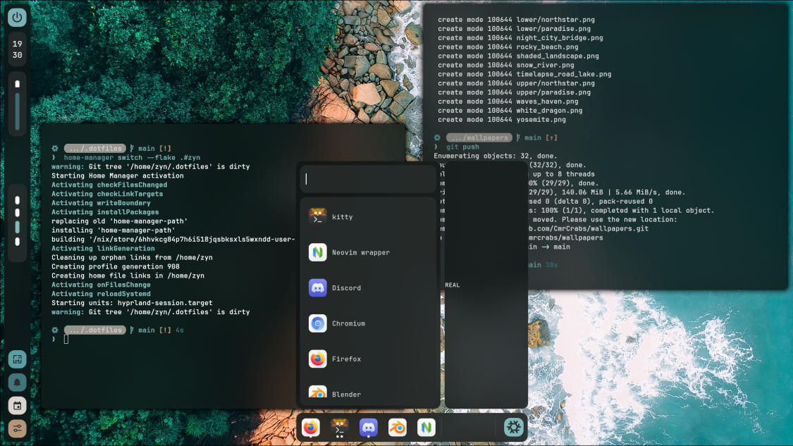

NixOS Environment - <name pending>

> [!Caution]
>
> under construction
> My old dots: https://github.com/cmrcrabs/dotfiles

# Temporary Preview:

# TODO: 
- [ ] Matugen / Wal Config Rewrite

    - [ ] gtk
    - [ ] nvim (prism)
    - [ ] gaps toggle
    - [ ] border toggle
    - [ ] dimming toggle

- [ ] Switch to Yazi
- [ ] toggle hypr border
- [ ] Switch to Unstable
- [ ] hyprland hdrop plugin
- [ ] hyprbars setup (windowrules & hyprbars)
- [ ] hyprspace
- [ ] redesign hyprlock to follow options

- [ ] AGS Setup
    - [ ] Notifications
    - [ ] Notification Log
    - [ ] Wifi / Volume / Microphone
    - [ ] Date / Music
    - [ ] Live Environment Editor
    - [ ] Horizontal Bar
    - [ ] rounded corners(?)
- [ ] Rofi Wallpaper Selector

- [ ] Nvim
    - [ ] Objects Viewer
    - [ ] better bufferline
    - [ ] better statusline
    - [ ] neorg(?)
    - [ ] include startup time on dash
    - [ ] matugen harmonise nvim
    - [ ] have rounding / flat respect matugen

- [ ] tmux

- [ ] firefox   
    - [ ] declarative firefox
    - [ ] pywalfox
    - [ ] firefox sidebery
    - [ ] sidebery pywal

- [ ] Misc App Setup
    - [ ] setup gamescope
    - [ ] Wine Setup
    - [ ] Setup Stylus Functionality & Pressure / Tilt
    - [ ] Setup Asus Dial Control Panel 
    - [ ] rewrite hyprlock to accept rounding changes

- [ ] Misc Nix Functionality Setup
    - [ ] Setup Nix-Secrets (agenix)
    - [ ] Dual Jack Microphone / Audio Setup
    - [ ] Setup refind 
    - [ ] setup brightness on lower screen
    - [ ] adjust hypridle & hypr binds for lower brightness
    - [ ] import / convert refind-minimal to nix
    - [ ] xdg-user-dirs

- [ ] Final package setup
    - [ ] move packages into corresponding home files
    - [ ] make hostname a variable
    - [ ] Properly Edit & Setup Wallpapers
    - [ ] Preview Images
    - [ ] Write Up README.md (use kaku as ref)
        - [ ] limitless gojo domain sign
        - [ ] steal catppuccin cat footer
    - [ ] Package whole rice as a derivation

# Credits:
for their great configs / learning resources / software

- LibrePhoenix
- Misterio77
- InioX
- datsfilipe
- Aylur
- HyprNova
- ChadCat7
- linuxmobile
- kotontrion (ags help)
