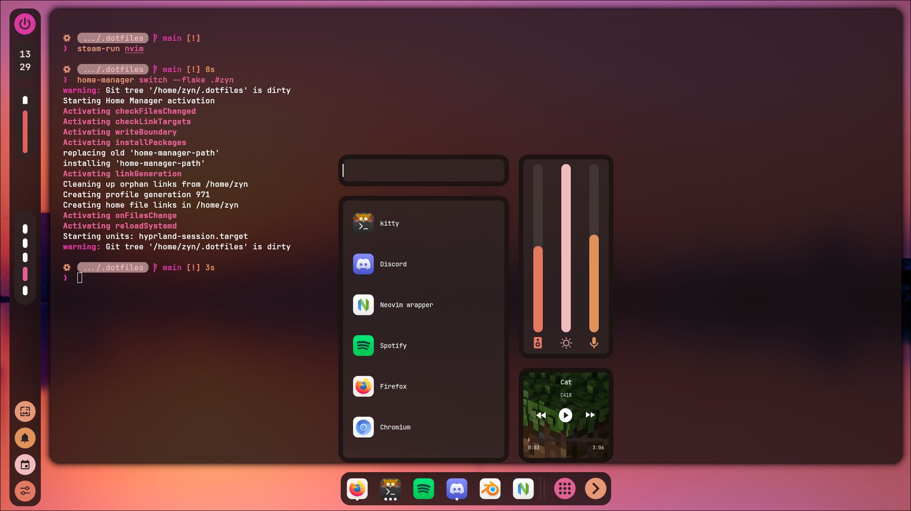
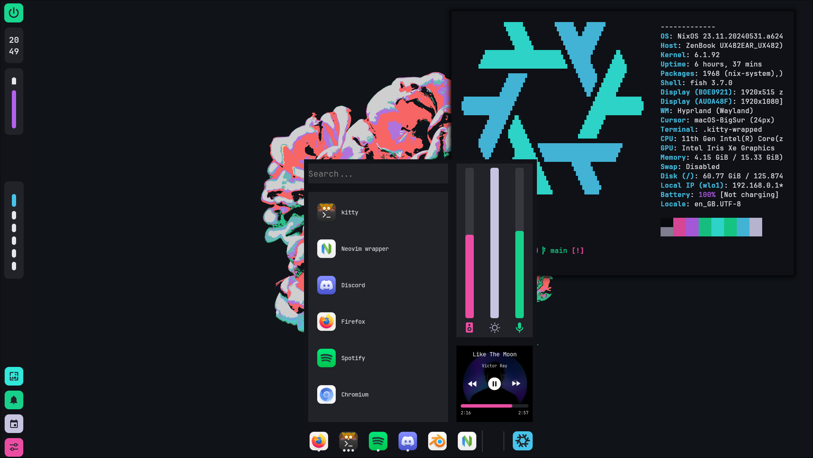

# NixOS Flake
> [!Caution]
>
> under construction
> My old dots: https://github.com/cmrcrabs/dotfiles

## Temporary Preview:

## TODO: 
- [ ] Get shadows working for all ags widgets + fix shadows for hyprland windows (for visibility)

- [ ] Matugen / Wal Config Rewrite
    - [ ] nvim (prism)
    - [ ] hypr colors for lockscreen & hyprbars

- [ ] fix gtk theme import
- [ ] gtk theme better (gradience ? )
- [ ] toggle hypr border
- [ ] Switch to Unstable
- [ ] hyprbars setup (windowrules & hyprbars) + use ags to change buttons to round / square
- [ ] hyprspace
- [ ] redesign hyprlock to follow options
- [ ] import / convert refind-minimal to nix
- [ ] make so if toggle floating on kitty window it sets size to the floating size
- [ ] fix sdhadow
- [ ] fix control center margin so that it uses gaps in future
- [ ] use gradience cli
- [ ] set up "header font" & "body font"
    - [ ] implement thru config
    - [ ] create ui for changing?

- [ ] AGS Setup
    - [ ] Wifi / Volume / Microphone
    - [ ] Live Environment Editor
    - [ ] Horizontal Bar
    - [ ] rounded corners(?)
- [ ] Rofi Wallpaper Selector
- [ ] power profiles
- [ ] ags vertical bar top and bottom margin fix
- [ ] add overview button to dock for hyprspace
- [ ] ags config file
- [ ] rewrite ags to support config file
- [ ] rewrite ags to support consistent cs vars IE:
    - [ ] $gap
    - [ ] $padding
    - [ ] $widget gap
    - [ ] $outer gap
    - [ ] fix rounding
    - [ ] write a button mixin
    - [ ] write a slider mixin
    - [ ] fix icon theme
    - [ ] fix seperator height

- [ ] add hyprpspace button
- [ ] when doing theme menu, ensure to add offsets to gap value passed to hyprland to account for a minimum
- [ ] add can click off to close window
- [ ] fix notification-log being offset upwards
- [ ] fix header
- [ ] add dock toggle
- [ ] fix notification button height 
- [ ] write script to auto go between macos walls https://www.idownloadblog.com/2020/06/22/macos-big-sur-wallpapers/
- [ ] fix noti button no working
- [ ] fix alt k
- [ ] include color preview gradient in ags somewhere
- [ ] fix mesa version mismatch
- [ ] gradience setup cli to do gtk theme
- [ ] make surface_container_lowest the shadow color
- [ ] switch to hyprcursor
- [ ] ags outer gaps, inner gaps, widget gaps etc
- [ ] make hyprland gaps seperate option to outer gap
- [ ] remove extra padding when 0 outer gap
- [ ] pywalfox thunderbird / find email client
- [ ] thunderbird lightning for google calendar integration

- [ ] Nvim
    - [ ] Objects Viewer
    - [ ] better bufferline
    - [ ] better statusline
    - [ ] neorg(?)
    - [ ] include startup time on dash
    - [ ] prism
    - [ ] have rounding / flat respect matugen

- [ ] firefox   
    - [ ] declarative firefox
    - [ ] pywalfox
    - [ ] firefox sidebery
    - [ ] sidebery pywal

- [ ] Misc App Setup
    - [ ] setup gamescope
    - [ ] Wine Setup
    - [ ] Setup Stylus Functionality & Pressure / Tilt
    - [ ] Setup Asus Dial Control Panel 
    - [ ] rewrite hyprlock to accept rounding changes

- [ ] Misc Nix Functionality Setup
    - [ ] Setup Nix-Secrets (agenix)
    - [ ] Dual Jack Microphone / Audio Setup
    - [ ] setup brightness on lower screen
    - [ ] adjust hypridle & hypr binds for lower brightness
    - [ ] xdg-user-dirs

- [ ] update cli env with:
    - [ ] zsh
    - [ ] tmux
    - [ ] zoxide

- [ ] Final package setup
    - [ ] move packages into corresponding home files
    - [ ] make hostname a variable
    - [ ] Properly Edit & Setup Wallpapers
    - [ ] Preview Images
    - [ ] Write Up README.md (use kaku as ref)
        - [ ] limitless gojo domain sign
        - [ ] steal catppuccin cat footer
    - [ ] Package whole rice as a derivation
    - [ ] setup entire cli environment install script 

## Credits:
for their great configs / learning resources / software

- LibrePhoenix
- Misterio77
- InioX
- datsfilipe
- Aylur
- HyprNova
- ChadCat7
- linuxmobile
- kotontrion (ags help)
- end4 
